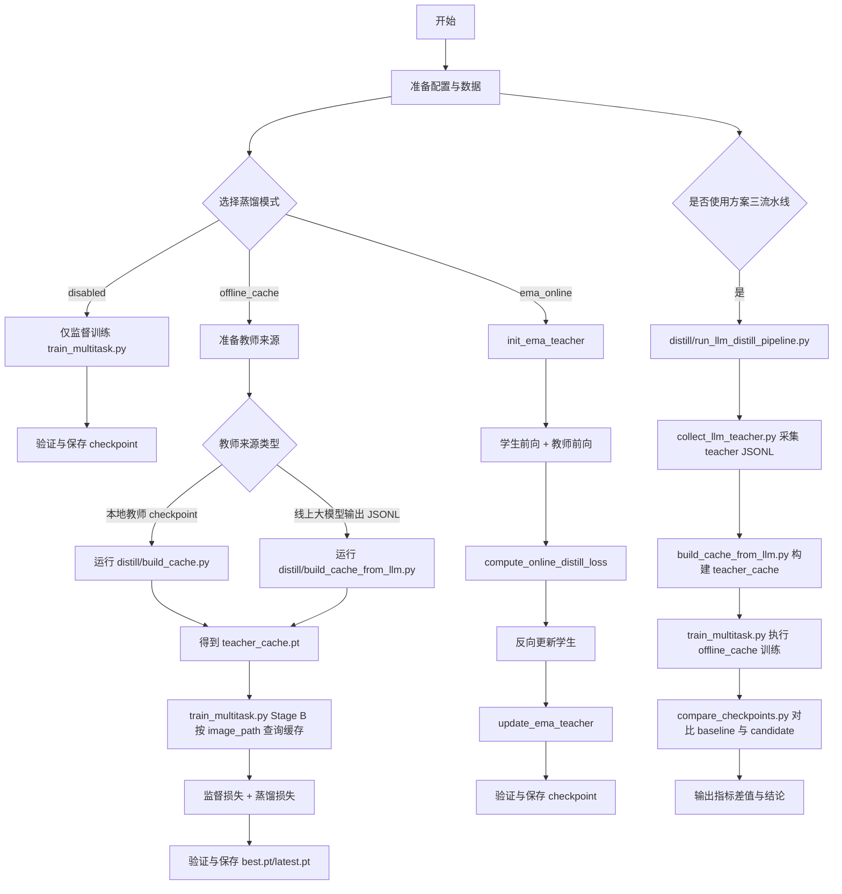

# 蒸馏全流程图

本文给出当前项目的蒸馏端到端流程，覆盖三条路径：

1. 离线缓存蒸馏（offline_cache）
2. 在线 EMA 自蒸馏（ema_online）
3. 方案三：线上大模型教师 -> 离线缓存蒸馏

## 关键脚本对照

1. 统一流水线：`distill/run_llm_distill_pipeline.py`
2. 线上教师采集：`distill/collect_llm_teacher.py`
3. JSONL 转缓存：`distill/build_cache_from_llm.py`
4. 本地教师转缓存：`distill/build_cache.py`
5. 训练入口：`train_multitask.py`
6. 指标对比：`distill/compare_checkpoints.py`

## 典型执行顺序（方案三）

1. 调用 `distill/run_llm_distill_pipeline.py`。
2. 自动执行教师采集并落盘 JSONL。
3. 自动构建 `teacher_cache.pt`。
4. 自动调用训练脚本完成蒸馏训练。
5. 可选对比 baseline 与蒸馏模型并输出指标增减。

## 产物清单

1. 教师原始输出：`distill/llm_teacher_outputs*.jsonl`
2. 教师缓存：`distill/teacher_cache_from_llm*.pt`
3. 训练权重：`outputs*/best.pt` 与 `outputs*/latest.pt`
4. 指标对比：终端输出（可重定向保存为日志）
